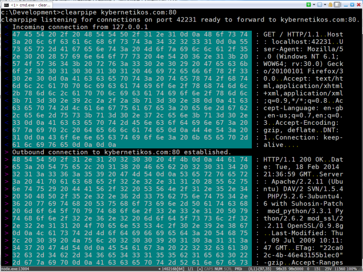

clearpipe
=========

A debugging proxy that shows the traffic going across the network.

Its useful for reverse engineering socket programs or checking that your socket program is behaving
the way it should be.

Installation
------------

    $ npm install -g clearpipe

Usage
-----

    $ clearpipe kybernetikos.com:80 8777

Then connect your client program, in this case a browser to localhost:8777 instead of
kybernetikos.com:80.
